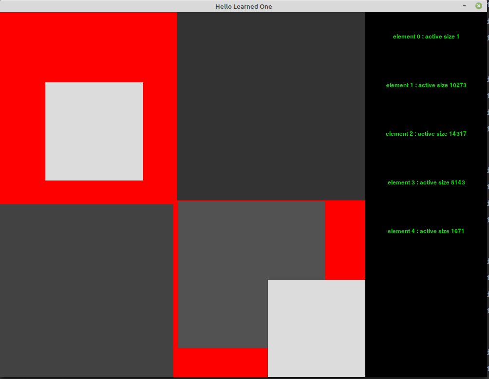

# SAO
## Shame And Obedience

### WIP'ed : On This 11th Of November Equates To Work-in-Progress (aka Sorry But Time Ain't Free)  
### UPDATE : Working program is up! 
### USAGE 
- Download: `git clone https://github.com/SabotageNDefenseIndustryExperi-Mentals/SAO.git`
- Run: `python3 main.py`

### Full Explanation 
See [my personal blog's post](https://richppp34.com/2020/01/01/on-the-game-of-sao-shame-and-obedience/) for a full explanation of the logistics behind this game. 

### Introduction
It started off as a shoutout. And now It's here. "It" in this
context means `SAO`, an acronym for the real thing, `Shame And Obedience`. Consider
from this point on worth that `SAO` always means `Shame And Obedience`, if only
for convenience.

This is a program that visualizes the transformation of languages over time through
alignment (or obedience) and silence (or shame). An appropriate descriptor term
for this program would be `simulation`, amongst others less known and only more
obscure.

This program operates on a gameboard that contains a variable number of elements.
Please be aware that this game is very computationally expensive. The capacity
on the variable number of elements has been set below 12 because of this reason.
The details of this expense will be elaborated upon in section `Problems`.  

The details for what goes on...on this gameboard are below.

### Details
This program operates on a gameboard of square dimension that contains `n < 12`
elements. The elements the gameboard contains are of the class `ShameAndObedienceElement`.

#### ShameAndObedienceElement
This element is represented by a grayshade (white through black) square on the gameboard. 
The really special thing about this `ShameAndObedienceElement` is that it does the
following things, in order to help aid the simulation, per se, of `SAO`:
- the `ShameAndObedienceElement` can speak a `Language`
- the `ShameAndObedienceElement` is fully capable of `shaming` or `aligning` with other
  `ShameAndObedienceElement` instances by language operations
- some of the outcomes of `ShameAndObedienceElement` is:
    - it goes mute from `shame`
    - its language includes all other languages (win from size)
    - it is the only speaker left on the gameboard (win from existence)
   

#### Language
- a `Language` is a bag-of-words
- the contents of `Language` is a set of words (call them `centroids`), and
  list or set of words (call them `descriptors`)
- an item in `descriptors` is always an important `definitional term` of some
  item in `centroids`. A `definitional term` is an important word found in the
  definition of some word.
- some language operations are:
  - `shame` operation: `shame` operations will involve two elements in which
                        one prohibits the other from using a set of terms.
  - `align` operation: `align` operations will involve two elements in which
                        a set of words will be shared between them, meaning
                        their languages overlap.

### Demo 
Below is a screenshot of a run. 

